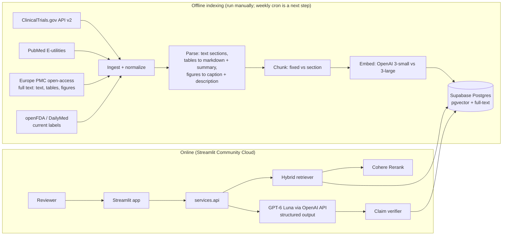

# Clinical RAG Brief Generator: Project Spec

Oct 3, 2026 · Gunjan Chaudhary

**What this is:** a personal learning and portfolio project, built entirely on public data: a RAG-based generator of cited, reviewable clinical competitive-landscape briefs.

**Technology:** OpenAI API (generation, embeddings) and Cohere API (reranking), called only through provider factories in llm.py. Data is current as of each ingestion run.

**Owner / architect:** Gunjan Chaudhary

**Model providers:** OpenAI API + Cohere API. Amazon Bedrock is the designed production target (section 4.3) and a Phase 2 run, not part of v1.

**Status:** Day 1 ingestion code exists (ClinicalTrials.gov + PubMed). Supabase project not yet created. Bedrock was dropped from v1 on 2026-10-03 because AWS new-account verification blocked access to every model (see decision log).

**Delivery:** one 10-hour build day (section 10), then a public GitHub repo with a live demo link.

## 0. How to use this document (read first, every agent)

1. This file is the **single source of truth**. If code and spec disagree, the spec wins until the architect changes it.
2. Each agent reads **sections 0–7 fully**, then **its own brief in section 8**.
3. **The contract in section 6 is frozen.** Backend and frontend both build against it. Changing it requires a written proposal to the architect, and all agents must be notified.
4. **Learning protocol (non-negotiable).** The architect must be able to explain and defend every design choice to anyone reviewing the project. Every pull request includes:
   - **What** changed (2–3 lines)
   - **Why** this approach
   - **Alternatives considered** and why they lost
   - **How to test it** (exact commands)
   - **Talking point:** one sentence the architect could use to explain it
   - If a design decision was made, a new row in `docs/decision_log.md`
5. Small PRs, one concern each. No PR over ~400 changed lines without a reason.
6. **Never** commit secrets. **Never** invent model IDs, prices, dates, or clinical facts. If unsure, leave a `TODO(architect):` and ask.

## 1. Problem and goals

**Problem.** Medical writers and commercial teams spend weeks assembling competitive landscape briefs from trial registries, literature, and product labels. Generic LLMs hallucinate trial results, which is unacceptable in a regulated setting.

**Product.** A web app that generates a **cited, reviewable competitive landscape brief** for GLP-1 / incretin therapies in obesity. Every claim links to its source (text, table, or figure). A human reviewer approves, edits, or rejects each section, and every action is logged.

### Goals (v1)

| # | Goal | Measure |
| --- | --- | --- |
| G1 | Retrieval finds the right sources | Doc-level recall@10 ≥ 0.85 on the golden set |
| G2 | Generated claims are grounded | ≥ 95% of claims pass automatic verification (citations valid, numbers present in sources) |
| G3 | The system refuses when it doesn't know | 100% of out-of-scope golden questions return "not found" |
| G4 | Tables and figures are usable evidence | Table and figure golden questions answered with correct citations; table-handling strategies compared |
| G5 | It's usable and shareable | Public URL, login-gated, full brief generated in < 3 minutes |
| G6 | It's affordable and safe to share | Cost per brief tracked and shown; daily cap enforced; OpenAI budget alert in place |

### Non-goals (v1)

| Non-goal | Why |
| --- | --- |
| Fine-tuning | Fine-tuning changes behavior, not knowledge. Facts here must be current and citable: labels and trial statuses change (a fine-tuned model would need retraining; RAG just re-ingests), and a fine-tuned model can't show which source a fact came from. Verified RAG already meets the grounding goals. Distilling to a smaller model is a later cost lever |
| Scanned PDFs (FDA review documents) | Phase 2: Bedrock Data Automation vs Textract |
| EMA EPARs, SEC filings, CMS Part D data, earnings-call audio | Phase 2 |
| Bedrock Knowledge Bases comparison (build vs buy) | Phase 2; strong talking point |
| Self-hosted biomedical embeddings (PubMedBERT) | Would need self-hosting; we compare two OpenAI embedding models instead |
| Multiple therapeutic areas | One indication keeps evaluation meaningful |
| Agentic multi-step retrieval | Phase 2 |
| AWS container hosting | Streamlit Community Cloud ships faster; production mapping in section 4.3 |
| Amazon Bedrock in v1 | New AWS account blocked by verification (Error 002 on every model). All model calls go through llm.py, so running on Bedrock is a Phase 2 config change |

## 2. The brief we generate

Indication: **obesity**. Every brief shows the date the data was last ingested.

Drugs in scope: semaglutide, tirzepatide, liraglutide, orforglipron, retatrutide, survodutide, cagrilintide, mazdutide. Several are still in development, so for them the brief mostly reports pipeline status and the data published so far.

| Section key | Title | Built from | LLM? |
| --- | --- | --- | --- |
| `pipeline` | Development pipeline by phase | `trials` table (SQL only) | **No.** Deterministic table |
| `efficacy` | Key efficacy results | PubMed abstracts; Europe PMC full text, including results tables | Yes |
| `safety` | Safety and tolerability | FDA label adverse-reaction tables; papers | Yes |
| `competitive_positioning` | Competitive positioning | Trials metadata, labels (dosing, administration), papers | Yes |
| `evidence_gaps` | Open questions and evidence gaps | Ongoing trials + "not found" items | Yes |

Design principle: **not everything goes through the LLM.** Facts that live in structured fields (phase, sponsor, enrollment, status) are queried with SQL.

## 3. Architecture



### Request flow for one LLM section

1. **Plan queries:** the section template expands into sub-queries per drug (e.g. "tirzepatide percent change in body weight primary endpoint").
2. **Query expansion:** drug code names are added (LY3502970 → orforglipron) from `drug_synonyms`.
3. **Hybrid retrieval:** one SQL call does vector search + keyword search + Reciprocal Rank Fusion, with metadata filters (drug, content type, source). Returns 20 candidates per sub-query.
4. **Rerank:** Cohere Rerank rescores candidates; keep the top 8 per drug. Skipped when `RERANK_ENABLED=false`.
5. **Context expansion:** text chunks pass their full parent section; table chunks pass the full markdown table; figure chunks pass caption + description.
6. **Generate:** GPT-6 Luna via `ChatOpenAI(...).with_structured_output(SectionDraft)`. The result is validated with Pydantic, with one retry on failure.
7. **Verify:** automatic checks (section 5.7). Failing claims are flagged, never hidden.
8. **Persist + audit:** draft, retrieved IDs, token usage, cost, and latency are stored; an audit event is written.
9. **Human review:** reviewer approves, edits, or rejects; logged.

## 4. Tech stack

### 4.1 What we build with

| Layer | Choice | Notes |
| --- | --- | --- |
| Language | Python 3.11+ | Type hints everywhere |
| Generation LLM | GPT-6 Luna via the OpenAI API, `langchain-openai` `ChatOpenAI` | Model ID from env `GEN_MODEL_ID` (confirmed by `scripts/check_providers.py`). Deterministic settings where the model supports them. Upgrade path: one eval run with GPT-6.1 Sol to measure whether the quality gain justifies ~20x the cost |
| Fast LLM | GPT-6 Luna, env `FAST_MODEL_ID` | Query expansion, table summaries, figure descriptions (Luna accepts image input). Separate env var so it can diverge from `GEN_MODEL_ID` |
| Embeddings | `text-embedding-3-small` and `text-embedding-3-large`, both with `dimensions=1024`, via `OpenAIEmbeddings` | Same vector size, so one schema serves both. Symmetric: queries and documents are embedded the same way |
| Reranker | Cohere Rerank via `langchain-cohere` | Model from env `RERANK_MODEL_ID`. Trial key limits apply (section 5.8). Flag `RERANK_ENABLED` |
| Orchestration | LangChain (`langchain-core`, `langchain-openai`, `langchain-cohere`, `langchain-text-splitters`) | Custom `BaseRetriever` wraps our SQL function. Model clients are created only in `llm.py` factories, so changing provider is a config change |
| Database | Supabase Postgres + `pgvector` | Connect with `psycopg` + `pgvector` (**not** `supabase-py`) so moving to Aurora PostgreSQL is a connection-string change |
| Keyword search | Postgres full-text search (`tsvector`, GIN index) | Not true BM25; documented trade-off |
| Validation | Pydantic v2 | Shared contract models in `clinical_rag/schemas.py` |
| Evaluation | Custom retrieval metrics + custom grounding checks; RAGAS optional | Results stored in Postgres |
| Frontend | Streamlit multipage app on Streamlit Community Cloud | |
| CI | GitHub Actions | Lint and tests on push |
| Lint / test | `ruff`, `pytest` | |
| Secrets | `.env` locally; Streamlit secrets; GitHub Actions secrets | `.env.example` committed, real values never |

### 4.2 Provider capabilities: used now vs phase 2

| Capability | v1 | Phase 2 / talking point |
| --- | --- | --- |
| OpenAI chat (GPT-6 Luna) with structured outputs | Used | One comparison run with GPT-6.1 Sol |
| OpenAI embeddings (3-small vs 3-large) | Used (compared) | |
| Cohere Rerank | Used (on vs off) | Second reranker: a self-hosted open-source cross-encoder (API vs self-hosted trade-off) |
| Vision (Luna image input) | Used for figure descriptions | |
| Prompt caching | Optional | Cache the long system prompt and section templates to cut cost |
| Same app on Amazon Bedrock | | Swap providers in `llm.py`; rerun the golden set and compare quality, latency, cost |
| Bedrock Data Automation | | Multimodal parsing (scanned PDFs, figures, slides) compared with the v1 pipeline |
| Bedrock Knowledge Bases | | Build-vs-buy comparison on the same golden set |
| Bedrock Evaluations (RAG evaluation) | | Run alongside the custom evaluation |
| Bedrock Guardrails (contextual grounding check, PII) | | Production layer on top of the verifier |

### 4.3 AWS production mapping (design only; not built)

| Demo | Production on AWS |
| --- | --- |
| OpenAI API + Cohere API | Amazon Bedrock: the same OpenAI models through US inference profiles, Bedrock Rerank; data stays in your AWS account and billing is one AWS bill |
| Supabase Postgres | Aurora PostgreSQL + pgvector |
| Streamlit Community Cloud | Container on ECS Express Mode (App Runner closed to new customers on 30 April 2026) |
| Manual ingestion | EventBridge Scheduler + Lambda / Step Functions |
| Access codes | Amazon Cognito or corporate SSO |
| Provider API keys in secrets | IAM roles with least-privilege Bedrock policies (no long-lived keys) |
| Postgres audit table | Plus CloudTrail; Bedrock Guardrails (contextual grounding check, PII filters) |
| Postgres (demo scale) | Aurora PostgreSQL + pgvector, or OpenSearch Serverless if true BM25 and larger scale are needed |

## 5. Data and backend design

### 5.1 Repository layout

```
clinical-rag/
├── PROJECT_SPEC.md              # this file
├── README.md                    # setup + run
├── requirements.txt
├── .env.example
├── .gitignore                   # includes .env, .streamlit/secrets.toml, data/raw/
├── streamlit_app.py             # Streamlit entry point (must be at repo root)
├── pages/                       # Streamlit pages (frontend agent)
├── ui/                          # shared UI components (frontend agent)
├── clinical_rag/                # backend package (backend agent)
│   ├── config.py
│   ├── schemas.py               # CONTRACT: shared Pydantic models
│   ├── llm.py                   # LangChain factories: chat, embeddings, rerank (the only place providers are named)
│   ├── db.py                    # connection pool, query helpers
│   ├── ingest/                  # ctgov.py, pubmed.py, europepmc.py, labels.py, load.py
│   ├── parsing/                 # tables.py, figures.py
│   ├── chunking/strategies.py
│   ├── index/embed.py
│   ├── retrieval/               # query_expansion.py, retriever.py, rerank.py
│   ├── generation/              # templates.py, sections.py, verify.py, brief.py, cost.py
│   ├── eval/                    # metrics.py, run_eval.py (eval agent)
│   └── services/
│       ├── api.py               # CONTRACT: functions the frontend calls
│       └── mock.py              # same signatures, fake data (frontend unblocks on day 1)
├── scripts/check_providers.py   # pre-flight smoke test (chat, structured output, embeddings, rerank)
├── db/migrations/               # 001_init.sql, 002_hybrid_search.sql
├── golden_set.jsonl             # architect owns the labels
├── docs/decision_log.md
├── tests/
└── .github/workflows/ci.yml
```

Day 1 code in `src/` moves to `clinical_rag/ingest/`. `bedrock_client.py` is retired: model clients live in `llm.py` and reranking in `retrieval/rerank.py`. `check_bedrock.py` becomes `scripts/check_providers.py`.

### 5.2 Data sources

Every document carries a `published_date`, and every brief shows the date of the last ingestion run.

| Source | Modality | Access | Filters | Verified |
| --- | --- | --- | --- | --- |
| ClinicalTrials.gov | Structured JSON + short text | API v2 `/studies`, `query.cond=obesity`, `query.intr=<drugs>` | Raise the cap to 600 to capture all matches | 528 matching trials |
| PubMed | Abstracts (structured sections) | E-utilities esearch/efetch | RCTs, 2018 onward | Day 1 code works |
| Europe PMC open access | Full text with **tables** and **figure captions** (JATS XML) | REST `search` + `/{PMCID}/fullTextXML` | `OPEN_ACCESS:y`, `PUB_TYPE:"randomized controlled trial"`, 2018 onward | 343 articles; license field present (e.g. `cc by-nc`) |
| FDA labels | Semi-structured label text + adverse-reaction **tables** | openFDA `/drug/label.json` (JSON sections incl. `adverse_reactions_table` as HTML); DailyMed for links | Current label version | Zepbound and Mounjaro labels return ~40 sections with tables |

Labels in scope: Wegovy, Ozempic, Zepbound, Mounjaro, Saxenda.

**Freshness:** registry status and labels change. Each document stores `ingested_at`, and the UI shows "status as of <ingestion date>". Re-running ingestion only re-embeds documents whose `content_hash` changed.

**Licenses:** store each document's license. Europe PMC articles vary (CC BY, CC BY-NC, …). The public app shows captions, descriptions, short snippets, and links, never full figures or long verbatim passages.

**Figure images:** direct image download from Europe PMC returned 403 in testing. Figure handling is therefore two-tier:

1. **Always:** figure caption + label become a `figure` chunk.
2. **Optional:** if image download works from the build machine, the fast model writes a factual description of the figure (axes, groups, timepoints, visible values), appended to the chunk. If not, captions-only is the documented outcome.

### 5.3 Database schema (`db/migrations/001_init.sql`)

```sql
create extension if not exists vector;

-- Structured registry facts: filtered with SQL, never embedded
create table trials (
  nct_id          text primary key,
  title           text,
  phase           text[],
  status          text,                        -- as of ingestion date
  sponsor         text,
  enrollment      int,
  first_posted    date,
  start_date      text,
  completion_date text,
  interventions   text[],
  conditions      text[],
  has_results     boolean,
  last_updated    text
);

-- Every source document
create table documents (
  doc_id         text primary key,             -- 'ctgov:NCT…' | 'pubmed:<pmid>' | 'epmc:<pmcid>' | 'label:<set_id>'
  source         text not null check (source in ('clinicaltrials.gov','pubmed','europepmc','dailymed')),
  url            text not null,
  title          text,
  published_date date,
  license        text,
  sections       jsonb not null,               -- {"results": "...", "methods": "..."}
  metadata       jsonb not null default '{}',  -- drugs, year, nct_ids, linked_trials, label effective date, ...
  content_hash   text not null,                -- skip re-chunk/re-embed when unchanged
  ingested_at    timestamptz not null default now()
);

create table chunks (
  chunk_id    text primary key,                -- '<doc_id>:<strategy>:<n>'
  doc_id      text not null references documents(doc_id) on delete cascade,
  strategy    text not null check (strategy in ('fixed','section')),
  section     text,
  content     text not null,                   -- what gets embedded and searched
  context     text,                            -- what the LLM receives (parent section / full table / caption + description)
  token_count int,
  metadata    jsonb not null default '{}',     -- content_type (text|table|figure), drugs, year, source, license, label
  fts         tsvector generated always as (to_tsvector('english', content)) stored
);
create index chunks_strategy_idx on chunks (strategy);
create index chunks_fts_idx      on chunks using gin (fts);
create index chunks_meta_idx     on chunks using gin (metadata jsonb_path_ops);

-- One row per (chunk, embedding model) so models can be compared side by side
create table chunk_embeddings (
  chunk_id  text not null references chunks(chunk_id) on delete cascade,
  model     text not null check (model in ('oai-3-small','oai-3-large')),
  embedding vector(1024) not null,
  primary key (chunk_id, model)
);
create index emb_small_hnsw  on chunk_embeddings using hnsw (embedding vector_cosine_ops) where model = 'oai-3-small';
create index emb_large_hnsw  on chunk_embeddings using hnsw (embedding vector_cosine_ops) where model = 'oai-3-large';

create table drug_synonyms (
  alias   text primary key,                    -- lowercase
  generic text not null
);
-- Seed (architect to verify and extend):
insert into drug_synonyms values
  ('ly3298176','tirzepatide'),
  ('ly3502970','orforglipron'),
  ('ly3437943','retatrutide'),
  ('bi 456906','survodutide');

create table briefs (
  brief_id     uuid primary key default gen_random_uuid(),
  requested_by text not null,
  request      jsonb not null,
  status       text not null default 'generating'
               check (status in ('generating','draft','in_review','approved','failed')),
  model_id     text not null,
  config       jsonb not null,                 -- strategy, embedding model, k, rerank model, data as-of date
  total_input_tokens  int default 0,
  total_output_tokens int default 0,
  total_cost_usd      numeric(10,4) default 0,
  latency_ms   int,
  created_at   timestamptz not null default now()
);

create table brief_sections (
  brief_id       uuid not null references briefs(brief_id) on delete cascade,
  section_key    text not null,
  draft          jsonb not null,
  retrieved_ids  text[] not null default '{}',
  review_status  text not null default 'pending'
                 check (review_status in ('pending','approved','edited','rejected')),
  reviewer_text  text,
  reviewed_by    text,
  reviewed_at    timestamptz,
  primary key (brief_id, section_key)
);

create table audit_log (
  id         bigserial primary key,
  brief_id   uuid references briefs(brief_id) on delete cascade,
  actor      text not null,
  event      text not null,                    -- generated | claim_flagged | approved | edited | rejected
  payload    jsonb not null default '{}',
  created_at timestamptz not null default now()
);

create table usage_daily (
  day    date primary key,
  briefs int not null default 0,
  asks   int not null default 0
);

create table eval_runs (
  run_id     uuid primary key default gen_random_uuid(),
  config     jsonb not null,
  metrics    jsonb not null,
  notes      text,
  created_at timestamptz not null default now()
);

create table eval_results (
  run_id            uuid not null references eval_runs(run_id) on delete cascade,
  question_id       text not null,
  retrieved_doc_ids text[] not null,
  recall_at_5       real,
  recall_at_10      real,
  reciprocal_rank   real,
  answer            jsonb,
  citation_valid    real,
  numbers_grounded  real,
  not_found_correct boolean,
  primary key (run_id, question_id)
);

-- Security: RLS on, no public policies. The app connects server-side as the DB owner.
do $$ declare t text; begin
  foreach t in array array['trials','documents','chunks','chunk_embeddings','drug_synonyms','briefs',
                           'brief_sections','audit_log','usage_daily','eval_runs','eval_results']
  loop execute format('alter table %I enable row level security', t); end loop;
end $$;
```

### 5.4 Hybrid search (`db/migrations/002_hybrid_search.sql`)

```sql
create or replace function hybrid_search(
  query_text      text,
  query_embedding vector(1024),
  embedding_model text  default 'oai-3-small',
  chunk_strategy  text  default 'section',
  metadata_filter jsonb default '{}'::jsonb,   -- e.g. {"drugs":["tirzepatide"],"content_type":"table"}
  match_count     int   default 20,
  candidate_pool  int   default 50,
  rrf_k           int   default 60
)
returns table (
  chunk_id text, doc_id text, section text, content text, context text, metadata jsonb,
  dense_rank bigint, keyword_rank bigint, rrf_score double precision
)
language sql stable
as $$
with q as (
  -- websearch_to_tsquery ANDs every term, too strict for questions; switch to OR
  select replace(websearch_to_tsquery('english', query_text)::text, '&', '|')::tsquery as tsq
),
dense as (
  select c.chunk_id,
         row_number() over (order by e.embedding <=> query_embedding) as rnk
  from chunks c
  join chunk_embeddings e on e.chunk_id = c.chunk_id and e.model = embedding_model
  where c.strategy = chunk_strategy
    and c.metadata @> metadata_filter
  order by e.embedding <=> query_embedding
  limit candidate_pool
),
keyword as (
  select c.chunk_id,
         row_number() over (order by ts_rank_cd(c.fts, q.tsq) desc) as rnk
  from chunks c, q
  where c.strategy = chunk_strategy
    and c.metadata @> metadata_filter
    and c.fts @@ q.tsq
  order by ts_rank_cd(c.fts, q.tsq) desc
  limit candidate_pool
),
fused as (
  select coalesce(d.chunk_id, k.chunk_id) as chunk_id,
         d.rnk as dense_rank,
         k.rnk as keyword_rank,
         coalesce(1.0 / (rrf_k + d.rnk), 0) + coalesce(1.0 / (rrf_k + k.rnk), 0) as rrf_score
  from dense d
  full outer join keyword k on d.chunk_id = k.chunk_id
)
select c.chunk_id, c.doc_id, c.section, c.content, c.context, c.metadata,
       f.dense_rank, f.keyword_rank, f.rrf_score::double precision
from fused f
join chunks c on c.chunk_id = f.chunk_id
order by f.rrf_score desc
limit match_count;
$$;
```

Notes the architect must understand:

- **RRF** uses ranks, not raw scores, so cosine distance and `ts_rank_cd` never need to be put on the same scale. `k = 60` is the common default; it dampens the advantage of the very top ranks.
- **Filtered vector search:** filtering while using an HNSW index can return fewer results than requested (the index finds nearest neighbors first, then the filter removes some). We over-fetch (`candidate_pool = 50`) and filter. At our size (~10k chunks) Postgres may simply do an exact scan, which is fine.
- **Dense-only and keyword-only** modes for the Search Lab are derived from `dense_rank` / `keyword_rank` in Python.

### 5.5 Parsing and chunking

| Content | Parsing | `content` (embedded + searched) | `context` (sent to LLM) |
| --- | --- | --- | --- |
| Text sections (abstracts, article sections, label sections) | Keep section labels from JATS / PubMed / SPL | The chunk text, prefixed `Title: … \| Section: …` | Full parent section |
| Tables (articles, labels) | Convert to markdown; keep caption, footnotes, column headers | Table caption + one-line summary written by the fast model + the header row | Full markdown table + footnotes |
| Figures (articles) | Caption + label from JATS; optional vision description (5.2) | Caption (+ description) | Same |

Chunking strategies compared:

| Strategy | Rule |
| --- | --- |
| `fixed` | `RecursiveCharacterTextSplitter`, ~512 tokens, ~64 overlap, over all body text. **Tables flattened as plain text** (the naive baseline) |
| `section` | One chunk per section; split further only above 512 tokens. **Tables and figures as their own chunks** per the table above |

This gives the table experiment for free: the same table questions answered under `fixed` (flattened) vs `section` (markdown + summary). Token counts use `tiktoken` with the encoding for the configured OpenAI model (fall back to `o200k_base` if `tiktoken` doesn't know the model yet), so chunk sizes match what is billed.

### 5.6 Embedding and refresh

- Both OpenAI models are called with `dimensions=1024`, so they share one `vector(1024)` column. They are symmetric: queries and documents are embedded the same way (unlike Cohere's `search_document` / `search_query` input types, a good contrast to explain).
- Batch calls, retry with exponential backoff on throttling.
- **Idempotent refresh:** ingestion computes `content_hash` per document. Unchanged documents are skipped; changed ones are re-chunked and re-embedded and their old chunks deleted (cascade).
- Changing an embedding model means re-embedding everything for that model. The model name is stored on every vector row.

### 5.7 Generation, verification, cost

**Section prompt rules (system prompt, every LLM section):**

1. Use only the provided sources. Each source is labeled with its `chunk_id` and content type (text, table, figure).
2. Every claim must cite one or more `chunk_id`s that directly support it.
3. Copy numbers exactly as written in the source (values, units, confidence intervals, timepoints, dose arms).
4. If information requested by the section is not in the sources, add it to `not_found`. Never fill gaps from general knowledge, even when the model "knows" the answer.
5. When citing a figure, describe only what the caption or description states; never estimate values from a figure.
6. Neutral, scientific tone. No promotional language, no treatment recommendations, no comparative superiority claims unless a head-to-head trial in the sources states it.

**Structured output:** `with_structured_output(SectionDraft)` on `ChatOpenAI` (OpenAI native structured outputs) → Pydantic validation → one retry with the validation error in the prompt → if it still fails, the section is marked `failed`. Format failures are counted in evaluation.

**Automatic verification (`generation/verify.py`), per claim:**

| Check | Fails when |
| --- | --- |
| Has citation | `citation_ids` is empty |
| Citation valid | A cited ID was not among the retrieved chunks for this section |
| Numbers grounded | Any number in the claim (integers, decimals, percentages, ranges; "−" normalized to "-") is absent from the `context` of every cited chunk |

Failed claims stay in the output with `verified=false` and a list of `issues`. They are never silently dropped; the reviewer decides.

**Cost (`generation/cost.py`):** token usage from LangChain's `usage_metadata`. Prices per 1M tokens live in config as `PRICES = {model_id: {"input": TODO, "output": TODO}}`. **The architect fills these from the OpenAI and Cohere pricing pages.** Agents never guess prices.

**Guardrails:** daily caps `MAX_BRIEFS_PER_DAY` (default 30) and `MAX_ASKS_PER_DAY` (default 200), checked in `services.api` before any model call. `max_tokens` capped per section.

### 5.8 Reranking

- `retrieval/rerank.py` calls Cohere Rerank (via `langchain-cohere`) on the RRF top 20 and keeps the top 8 per drug.
- `RERANK_MODEL_ID` is config. `TODO(architect):` confirm the current English rerank model ID in Cohere's docs.
- Trial key limits: 10 rerank requests per minute and 1,000 API calls per month across all endpoints; non-production use only. The eval sweep must fit inside this. The deployed demo either lowers `MAX_ASKS_PER_DAY` or runs with `RERANK_ENABLED=false`.
- `RERANK_ENABLED=false` must work everywhere; the eval sweep always runs on and off so the lift is measured, not assumed.

## 6. CONTRACT: backend ↔ frontend (frozen)

The frontend imports **only** `clinical_rag.services.api` (or `mock`) and `clinical_rag.schemas`. It never touches SQL, LangChain, or provider SDKs.

### 6.1 Models (`clinical_rag/schemas.py`)

```python
from datetime import date, datetime
from typing import Literal
from pydantic import BaseModel, Field

SectionKey = Literal["pipeline", "efficacy", "safety", "competitive_positioning", "evidence_gaps"]
SearchMode = Literal["dense", "keyword", "hybrid"]
Strategy = Literal["fixed", "section"]
EmbeddingModel = Literal["oai-3-small", "oai-3-large"]
ContentType = Literal["text", "table", "figure"]
SourceName = Literal["clinicaltrials.gov", "pubmed", "europepmc", "dailymed"]

class Usage(BaseModel):
    input_tokens: int = 0
    output_tokens: int = 0
    cost_usd: float = 0.0
    latency_ms: int = 0

class Source(BaseModel):
    chunk_id: str
    doc_id: str
    source: SourceName
    content_type: ContentType
    title: str
    url: str
    published_date: date | None = None
    license: str | None = None
    section: str | None = None
    label: str | None = None          # e.g. "Table 2", "Figure 1"
    snippet: str                      # short text shown in the UI (never a full figure or table dump)

class Claim(BaseModel):
    text: str
    citation_ids: list[str]
    verified: bool = True
    issues: list[str] = Field(default_factory=list)

class TrialRow(BaseModel):
    nct_id: str
    title: str
    drug: str | None
    phase: list[str]
    status: str | None                # as of ingestion date
    sponsor: str | None
    enrollment: int | None
    first_posted: date | None
    url: str

class SectionDraft(BaseModel):
    section_key: SectionKey
    title: str
    claims: list[Claim] = Field(default_factory=list)
    table: list[TrialRow] | None = None   # only for 'pipeline'
    not_found: list[str] = Field(default_factory=list)
    sources: list[Source] = Field(default_factory=list)
    usage: Usage = Usage()
    review_status: Literal["pending", "approved", "edited", "rejected", "failed"] = "pending"
    reviewer_text: str | None = None

class BriefRequest(BaseModel):
    indication: Literal["obesity"] = "obesity"
    drugs: list[str]
    sections: list[SectionKey]
    requested_by: str

class Brief(BaseModel):
    brief_id: str
    request: BriefRequest
    data_as_of: date                  # date of the last ingestion run
    status: Literal["generating", "draft", "in_review", "approved", "failed"]
    sections: list[SectionDraft]
    usage: Usage
    created_at: datetime

class BriefSummary(BaseModel):
    brief_id: str
    requested_by: str
    drugs: list[str]
    status: str
    cost_usd: float
    created_at: datetime

class ReviewAction(BaseModel):
    brief_id: str
    section_key: SectionKey
    action: Literal["approve", "edit", "reject"]
    reviewer: str
    edited_text: str | None = None
    comment: str | None = None

class AuditEvent(BaseModel):
    actor: str
    event: str
    payload: dict
    created_at: datetime

class SearchHit(BaseModel):
    source: Source
    dense_rank: int | None
    keyword_rank: int | None
    rrf_score: float | None
    rerank_score: float | None = None

class Answer(BaseModel):
    question: str
    claims: list[Claim]
    not_found: list[str]
    sources: list[Source]
    usage: Usage

class PipelineFilters(BaseModel):
    drugs: list[str] | None = None
    phases: list[str] | None = None
    statuses: list[str] | None = None

class UsageStatus(BaseModel):
    briefs_today: int
    briefs_cap: int
    asks_today: int
    asks_cap: int

class EvalRunSummary(BaseModel):
    run_id: str
    created_at: datetime
    config: dict          # strategy, embedding_model, mode, rerank, k
    metrics: dict         # recall_at_5, recall_at_10, mrr, citation_valid, numbers_grounded, not_found_accuracy, by question type
    notes: str | None
```

### 6.2 Functions (`clinical_rag/services/api.py`)

```python
from typing import Callable

def generate_brief(req: BriefRequest,
                   on_progress: Callable[[SectionKey, str], None] | None = None) -> Brief: ...
    # on_progress(section_key, "retrieving" | "generating" | "verifying" | "done" | "failed")
    # Raises CapExceededError if the daily cap is reached.
def get_brief(brief_id: str) -> Brief: ...
def list_briefs(limit: int = 20) -> list[BriefSummary]: ...
def submit_review(action: ReviewAction) -> SectionDraft: ...
def get_audit_log(brief_id: str) -> list[AuditEvent]: ...

def ask(question: str, asked_by: str) -> Answer: ...          # single-question RAG, also used by eval
def search(query: str, mode: SearchMode = "hybrid", strategy: Strategy = "section",
           embedding_model: EmbeddingModel = "oai-3-small", drugs: list[str] | None = None,
           content_types: list[ContentType] | None = None,
           k: int = 10, rerank: bool = True) -> list[SearchHit]: ...

def get_pipeline(filters: PipelineFilters) -> list[TrialRow]: ...
def get_usage_today() -> UsageStatus: ...
def list_eval_runs() -> list[EvalRunSummary]: ...

class CapExceededError(Exception): ...
```

`services/mock.py` implements every function with realistic fake data (including table and figure sources) and a `time.sleep` to simulate latency, so the frontend can be built before the backend is ready. Switching is one env var: `USE_MOCK=1`.

## 7. Frontend design (Streamlit)

**Audience:** engineers, hiring managers, and peers clicking a shared link. It must look credible within 10 seconds and explain itself.

| Page | Purpose | Key elements |
| --- | --- | --- |
| `streamlit_app.py` (Home) | Login + orientation | Access-code gate (codes in `st.secrets["ACCESS_CODES"]`, code → display name). One-paragraph explanation, short architecture summary, **"Data as of <last ingestion date>" banner**. Disclaimer: "Learning project on public data. Not medical advice." One **Ask** box (calls `ask()`) |
| `pages/1_Generate.py` | Create a brief | Drug multiselect, section checkboxes, usage meter, Generate button, live per-section progress via `on_progress` + `st.status` |
| `pages/2_Review.py` | Review a brief | Brief picker; per section: claims with citation chips `[1] [2]` → expander with source snippet, content-type badge (text / table / figure), label, license, published date, link. **Unverified claims visibly flagged** with their issues. `not_found` list. Pipeline section as `st.dataframe` with "status as of <ingestion date>" note. Approve / Edit / Reject per section; audit trail; cost + latency footer |
| `pages/3_Search_Lab.py` | Show *why* the design choices matter | Query box; three columns: dense / keyword / hybrid side by side; toggles for strategy, embedding model, rerank, content type. Presets: "NCT05872620", "LY3502970", "weight loss at week 72", "nausea incidence by dose" (table), "body weight over time figure" (figure) |
| `pages/4_Pipeline.py` | Deterministic data view | Filters → `get_pipeline` → table + phase bar chart. Caption: "No LLM used on this page." |
| `pages/5_Evaluation.py` | Prove quality | Retrieval comparison across configs; recall@k / MRR chart; **results broken down by question type** (text, table, figure, synonym, out-of-scope); highlight the chosen config |

UI rules: Streamlit components only (no custom JS); `st.session_state` holds the logged-in name; every page checks login; errors shown with `st.error` plus a plain-language message, never a raw stack trace; cache read-only calls with `st.cache_data(ttl=300)`; never cache generation; **never display figure images or full tables from licensed articles** (show snippet + link).

## 8. Agents

### Roles

| Role | Who | Owns |
| --- | --- | --- |
| **Architect / product owner** | Gunjan | This spec, decision log, golden-set labels, prices, final review and merge, the project write-up |
| **Backend agent** | Agent 1 | `clinical_rag/` (except `eval/`), `db/migrations/`, `scripts/` |
| **Frontend agent** | Agent 2 | `streamlit_app.py`, `pages/`, `ui/`, Streamlit deployment |
| **Eval & QA agent** | Agent 3 | `clinical_rag/eval/`, integration tests, `ci.yml` |

Infra/security tasks are split: backend owns DB + GitHub secrets; frontend owns Streamlit secrets + deploy.

### 8.1 Backend agent: brief

> You are the backend engineer for the project described in `PROJECT_SPEC.md`. Read sections 0–7. You own `clinical_rag/` (except `eval/`), `db/migrations/`, and `scripts/`. Build against the frozen contract in section 6. Your first deliverable is `schemas.py` and `services/mock.py` so the frontend is unblocked. Create every model client (chat, embeddings, rerank) only through factories in `llm.py`, using `langchain-openai` and `langchain-cohere`; no other module imports a provider SDK. Use `psycopg` + `pgvector` for the database. Never hardcode model IDs, prices, or secrets. Follow the learning protocol in section 0 for every PR.

**Tasks, in order**

1. `schemas.py`, `services/mock.py`, `config.py`, `.env.example`; move Day 1 code into `clinical_rag/ingest/` and apply the 5.2 filters.
2. Migrations 001 and 002. `ingest/europepmc.py` (JATS → text sections, markdown tables, figure captions, license, date). `ingest/labels.py` (openFDA current labels). `ingest/load.py` (upsert with `content_hash`).
3. `parsing/` + `chunking/strategies.py` (both strategies, per 5.5) and `index/embed.py` (both models, batching, retries, skip unchanged).
4. `retrieval/`: query expansion, `HybridPostgresRetriever(BaseRetriever)`, `rerank.py` (Cohere Rerank), context expansion. Then `generation/verify.py` and `ask()`.
5. `generation/`: templates, structured output with validation + retry, `cost.py`, `brief.py` (LLM sections run concurrently).
6. `services/api.py`: real implementations, daily caps, audit events.

**Definition of done**

- [ ] A fresh run of ingest → load → embed populates all tables; a re-run with no source changes embeds 0 chunks
- [ ] Every document has `published_date` (or an explicit null reason) and `license` where the source provides one
- [ ] `search("NCT05872620", mode="keyword")` returns that trial first; `search("LY3502970")` returns orforglipron documents
- [ ] `search("nausea", content_types=["table"])` returns label adverse-reaction tables
- [ ] `ask("What is the list price of Wegovy in Germany?")` returns `not_found`
- [ ] `generate_brief` for 2 drugs × all sections completes in < 3 minutes, with usage and cost recorded
- [ ] Unit tests: chunking, table → markdown, verification (including a planted fake number), RRF ordering

### 8.2 Frontend agent: brief

> You are the frontend engineer for the project described in `PROJECT_SPEC.md`. Read sections 0–7. You own `streamlit_app.py`, `pages/`, and `ui/`. Import only `clinical_rag.services.api` (or `mock` when `USE_MOCK=1`) and `clinical_rag.schemas`. Start immediately against the mock. The audience is anyone clicking a shared link: clarity and credibility matter more than visual flair. Follow the learning protocol in section 0 for every PR.

**Tasks, in order**

1. Login gate + Home (with the Ask box and data-as-of banner) + shared layout (`ui/layout.py`: sidebar with user name, usage meter, disclaimer).
2. Generate page with live progress.
3. Review page: claims, citation chips with content-type badges, flagged claims, review actions, audit trail.
4. Search Lab (the key demo page), then Pipeline, then Evaluation.
5. Deploy to Streamlit Community Cloud from GitHub; configure secrets; verify on a phone browser.

**Definition of done**

- [ ] Every page works end to end on `USE_MOCK=1` and on the real backend
- [ ] Unverified claims are impossible to miss; a source is never more than one click from its claim
- [ ] Cap reached → friendly message, no model call
- [ ] No page shows a raw stack trace; logged-out users see only the login screen
- [ ] Public URL works in an incognito window

### 8.3 Eval & QA agent: brief

> You are the evaluation and QA engineer for the project described in `PROJECT_SPEC.md`. Read sections 0–7 and 12. You own `clinical_rag/eval/`, integration tests, and CI. You do **not** write golden-set labels; the architect does. Your job is to make quality measurable and comparisons honest.

**Tasks**

1. `eval/metrics.py`: doc-level recall@5, recall@10, MRR. Labels are at **document** level so they stay valid when chunking changes.
2. `eval/run_eval.py --strategy … --embedding-model … --mode … --rerank on|off`: retrieval runs; `--with-generation` adds `ask()` per question with citation-valid rate, numbers-grounded rate, not-found accuracy, and format-failure rate. Writes to `eval_runs` / `eval_results`. **Every metric is also reported per question type.**
3. Sweep: 2 strategies × 2 embedding models × 3 modes × rerank (off / on) (retrieval only, cheap). Generation eval on the chosen config.
4. `docs/eval_report.md`: results table, the chosen config, the **table experiment** (fixed/flattened vs section/markdown on table questions), and 3 concrete failure examples with explanations.
5. `ci.yml`: ruff + pytest on every push.

**Definition of done**

- [ ] One command reproduces every number in the eval report
- [ ] Report includes at least one thing that *didn't* work and why

## 9. Infrastructure, security, cost

| Item | Owner | Setting |
| --- | --- | --- |
| Supabase project | Architect (via Claude) | `clinical-rag`, free plan, `us-east-1` |
| OpenAI API project | Architect | Project `clinical-rag`, $10 prepaid credit, monthly budget alert, project-scoped API key. New accounts start at a low usage tier, so expect rate limits during bulk embedding (retry with backoff, section 5.6) |
| Cohere API key | Architect | Trial key: free, 10 rerank calls/min, 1,000 calls/month, non-production use only. Apply for a production key only if the demo needs it |
| Spend controls | Architect | Prepaid OpenAI credit is the hard cap; app-level daily caps (section 5.7) |
| Secrets | All | `OPENAI_API_KEY`, `COHERE_API_KEY`, `GEN_MODEL_ID`, `FAST_MODEL_ID`, `RERANK_MODEL_ID`, `RERANK_ENABLED`, `DATABASE_URL` (Supabase pooler string), `NCBI_EMAIL`, `ACCESS_CODES`. Locally in `.env`; Streamlit secrets; GitHub Actions secrets. Never in git |
| AWS account | Architect | Created; Bedrock blocked pending account verification. Not on the v1 critical path; used for the Phase 2 Bedrock run |
| Free-tier behavior | Architect | Supabase pauses after ~1 week idle; Streamlit sleeps when idle; the Cohere trial monthly cap resets on the 1st. Open the app shortly before any demo |

## 10. Timeline: one-day, 10-hour build

### Pre-flight (evening before, owner: architect). Not done = do not start.

- [ ] OpenAI project `clinical-rag` created, $10 credit loaded, budget alert set, API key in `.env`
- [ ] Cohere trial key in `.env`
- [ ] `scripts/check_providers.py` passes (chat, structured output, both embedding models, rerank); `GEN_MODEL_ID`, `FAST_MODEL_ID`, `RERANK_MODEL_ID` known
- [ ] Supabase project `clinical-rag` created; `DATABASE_URL` (pooler) saved
- [ ] GitHub repo with Day 1 code + this spec; Streamlit Community Cloud linked to GitHub
- [ ] OpenAI and Cohere prices copied into config
- [ ] Starter golden set (section 12) reviewed

### Scope cut order (when behind, cut from the top)

1. Figure vision descriptions → captions only
2. `text-embedding-3-large` comparison → `text-embedding-3-small` only
3. Reranking in the deployed app → `RERANK_ENABLED=false` (keep the on/off comparison in the eval)
4. Europe PMC full text → labels remain the table source
5. Never cut: hybrid search, verification, the Review page, the eval, the deployment

### Schedule

| Hours | Backend | Frontend | Eval & QA | Architect |
| --- | --- | --- | --- | --- |
| 0:00–0:30 | `schemas.py` + `services/mock.py` pushed FIRST | Login gate, layout | Metrics scaffold | Launch agents; start golden-set labels |
| 0:30–3:00 | Migrations; ingest all four sources; parse; chunk; embed | Generate + Review on mock | `run_eval.py`, unit tests, CI | Label ≥ 25 questions; review/merge PRs |
| **3:00 checkpoint** | Data loaded and embedded? If not, apply cut order | | | Go / no-go |
| 3:00–5:00 | Retriever, rerank, `verify.py`, `search()`, `ask()` | Search Lab, Pipeline | Retrieval sweep as soon as `search()` merges | Review/merge |
| **5:00 checkpoint** | Search returns NCT / LY-code / table hits? If not, apply cut order | | | Choose config from the sweep |
| 5:00–7:00 | `generate_brief`, structured output + retry, caps, audit | Evaluation page; switch `USE_MOCK=0` | Eval report draft, table experiment | End-to-end test locally; fill prices |
| 7:00–8:30 | Integration fixes | **Deploy starts at 7:00 regardless** | Generation eval on chosen config | Smoke-test public URL (incognito + phone) |
| 8:30–10:00 | **Feature freeze.** Bugs only | Polish | Final run | Decision log, record numbers, rehearse the demo |

### Working rules

- Each agent works on its own branch (or git worktree). Only the architect merges, after reading the PR's learning-protocol notes.
- Checkpoints are decisions, not extensions: the milestone works or the next item in the cut order goes.
- A live link with fewer features beats a complete app that only runs locally.

## 11. What the architect must be able to explain

Self-check before demoing or presenting the project: answer each out loud in under 90 seconds without notes.

| Area | Questions to own |
| --- | --- |
| Data | Why are phase and status metadata, not embedded text? How do papers link to trials? How does refresh avoid re-embedding everything? How do you keep registry status and labels fresh, and how do users know how current the data is? |
| Multimodal | How are tables represented for retrieval vs generation (summary vs full markdown)? What did flattening tables do to table questions? How are figures handled, and why never estimate values from a figure? Why store licenses? |
| Chunking | What did the two strategies show on the eval? What failed with fixed-size chunks and why? |
| Embeddings | 3-small vs 3-large results and whether the bigger model was worth it; symmetric vs asymmetric embeddings; cost of switching models (re-embed everything) |
| Retrieval | Why hybrid; what RRF does; why rerank a shortlist instead of the corpus; rerank on vs off results; how top-k was chosen; the filtered-HNSW problem |
| Generation | How a trial result can't be invented (prompt rules → tool-based structured output + validation → numeric verification → human review); why the pipeline section uses no LLM; how out-of-scope questions are refused |
| Evaluation | Why labels are at document level; recall@k vs MRR; results by question type; one failure you found and fixed |
| Security and cost | API key handling (project-scoped, never in git); daily caps; budget alert; RLS; secrets handling; cost per brief |
| Compliance | Human sign-off, audit trail, MLR review, why promotional language is prohibited, licenses and copyright on third-party content |
| Architecture | Build vs Bedrock Knowledge Bases; Bedrock Data Automation vs a custom parsing pipeline; the production mapping (section 4.3), including the move to Bedrock; how this would move to Azure (`ChatOpenAI` → `AzureChatOpenAI`; Postgres → Azure Database for PostgreSQL with pgvector) |
| Framework | Why LangChain for orchestration but raw SQL for retrieval |
| Fine-tuning | Why not: behavior vs knowledge; when distillation would become worth it |
| Providers | Why direct OpenAI + Cohere APIs in v1 (AWS account verification blocked Bedrock); what moving to Bedrock adds (IAM instead of API keys, data stays in your AWS account, one bill) and what it costs; how llm.py makes the swap a config change |

## 12. Golden set (starter, architect labels before hour 3)

Format: one JSON object per line in `golden_set.jsonl` with `id`, `type`, `question`, `relevant_doc_ids` (document level), `expected_answer` (`NOT_FOUND` for refusals). Target ≥ 25 questions covering every type. Every expected answer must be supported by a document actually present in the ingested corpus.

| id | type | question | note |
| --- | --- | --- | --- |
| q01 | numeric_fact | What weight reduction did tirzepatide achieve versus placebo in SURMOUNT-1? | |
| q02 | population | What weight loss did tirzepatide show in people with obesity and type 2 diabetes? | |
| q03 | numeric_fact | What was the mean change in body weight with semaglutide 2.4 mg in STEP 1? | |
| q04 | id_lookup | What is the primary endpoint of NCT05872620? | Registry |
| q05 | synonym | Which trials studied LY3502970? | Tests code-name expansion |
| q06 | pipeline_metadata | Which phase 3 retatrutide trials are currently recruiting? | Should come from SQL, not embeddings |
| q07 | table | What was the incidence of nausea at each Zepbound dose in the label's adverse reactions table? | Current label |
| q08 | table | Which adverse reactions occurred in at least 5% of Wegovy-treated patients? | Label table |
| q09 | table | (Architect picks a results table from a Europe PMC article) | |
| q10 | figure | (Architect picks a figure caption, e.g. body weight change over time) | Captions-only must still answer it |
| q11 | safety | What were the most common adverse events with semaglutide 2.4 mg in obesity trials? | |
| q12 | numeric_fact | What weight reduction did orforglipron achieve in its phase 3 obesity trial? | Confirm the source paper is in the corpus |
| q13 | comparison | How did tirzepatide compare with semaglutide in the SURMOUNT-5 head-to-head trial? | Tests comparison claims; only allowed because a head-to-head trial exists |
| q14 | out_of_scope | What is the list price of Wegovy in Germany? | `NOT_FOUND` |
| q15 | out_of_scope | What were the phase 3 results for survodutide in Alzheimer's disease? | `NOT_FOUND` |

Architect: verify every non-refusal answer against its source and its publication date, then add ≥ 10 more (at least 2 more table, 1 more figure, 2 more out-of-scope).

## 13. Project framing and roadmap

**Positioning.** This is an independent learning and portfolio project built entirely on public data. It exists to explore and demonstrate the design choices behind a trustworthy clinical RAG system: hybrid retrieval, multimodal evidence, claim verification, human review, and honest evaluation. Every result reported in the repo comes from this project's own golden set and eval runs.

**What comes next**

- Compare Bedrock Data Automation against the current text/table/figure pipeline on the same golden set.
- Run the Bedrock Knowledge Bases build-vs-buy comparison.
- Add Bedrock Guardrails (contextual grounding check) as a production layer on top of the verifier.
- Re-run the golden set before every model upgrade, because new models can change citation behavior.

**Phase 2 roadmap:** scanned FDA review documents with Bedrock Data Automation; EMA EPARs; Bedrock Knowledge Bases build-vs-buy comparison on the same golden set; SQL routing for structured questions (CMS Part D spend, SEC financials); GraphRAG linking trials, drugs, and endpoints; scheduled refresh with EventBridge; the same app on Amazon Bedrock, compared on the golden set.

## 14. Open questions

| Question | Owner | Blocking? |
| --- | --- | --- |
| Exact OpenAI model IDs for GPT-6 Luna (and GPT-6.1 Sol for the comparison run) | Architect (`scripts/check_providers.py`) | Yes, pre-flight |
| Current Cohere rerank model ID | Architect (Cohere docs) | Yes, pre-flight |
| OpenAI and Cohere prices per model | Architect (pricing pages) | Yes, pre-flight |
| Does the Cohere trial cap (1,000 calls/month) cover the eval sweep and the demo? If not, apply for a production key or ship with rerank off | Architect | No |
| Can figure images be downloaded from the build machine? | Backend | No (captions-only fallback) |
| Verify and extend `drug_synonyms` seed | Architect | No |
| Access-code list and display names | Architect | Yes, before deploy |
| AWS account verification (for the Phase 2 Bedrock run) | Architect | No |